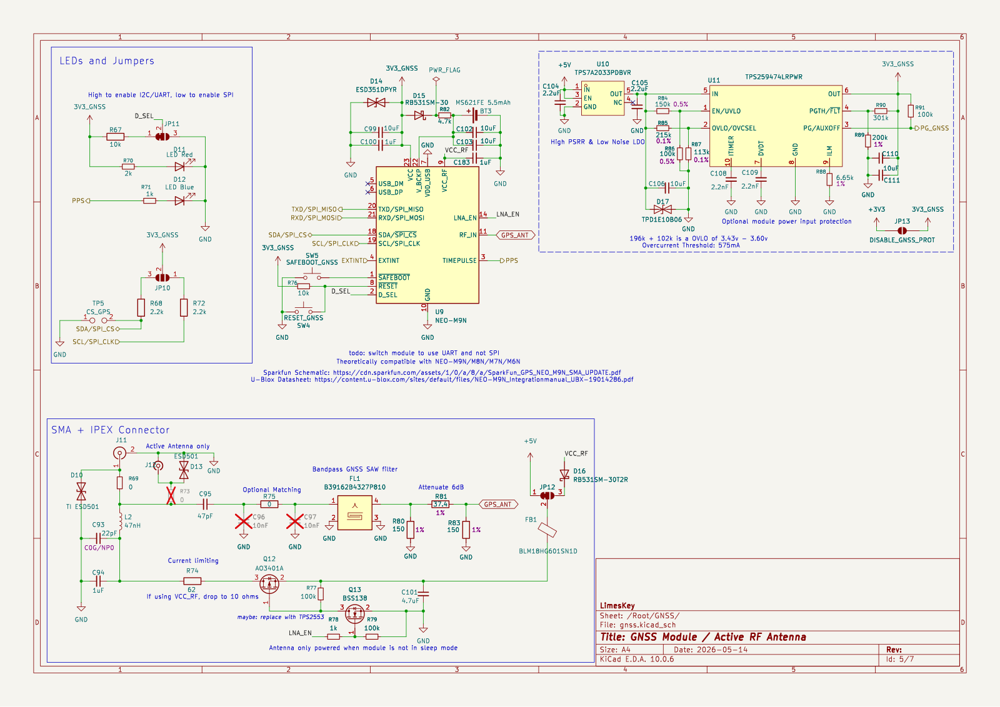
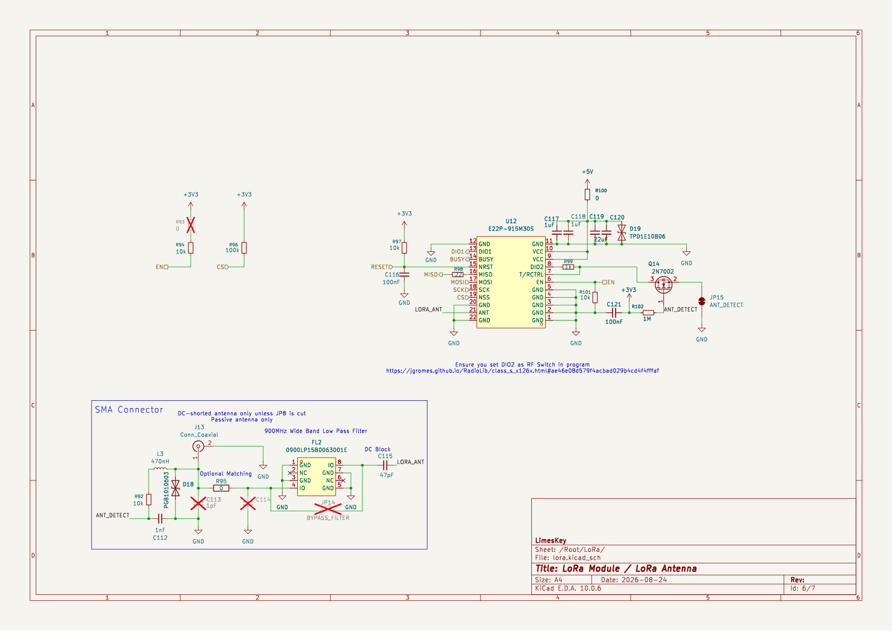
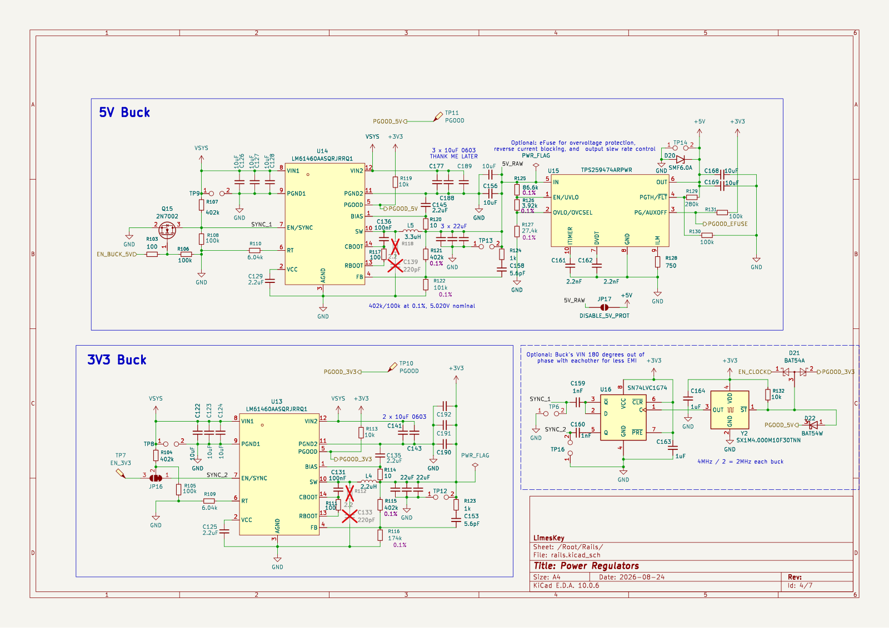
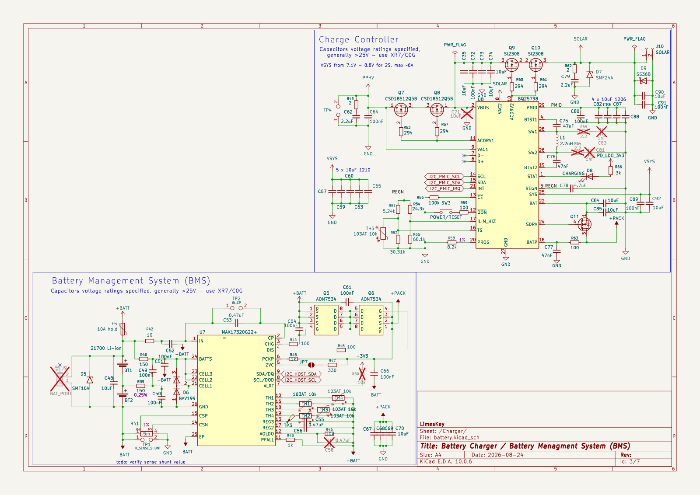
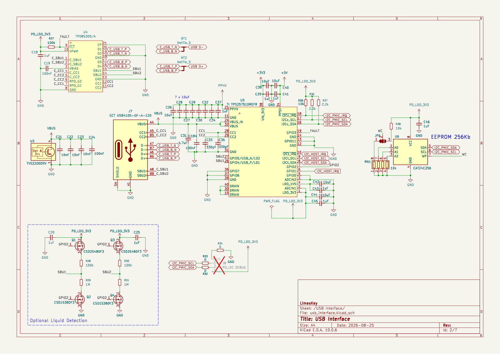
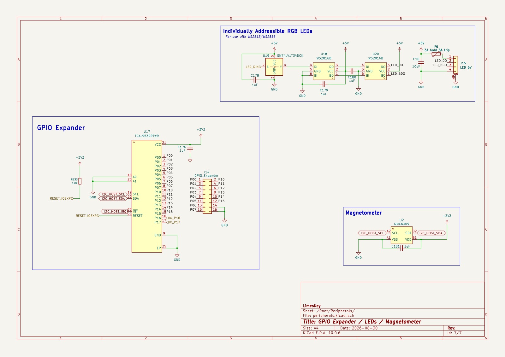
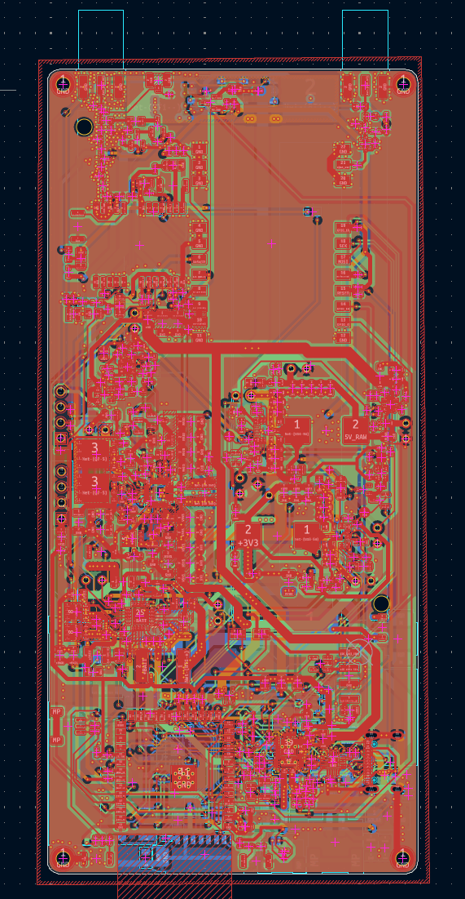
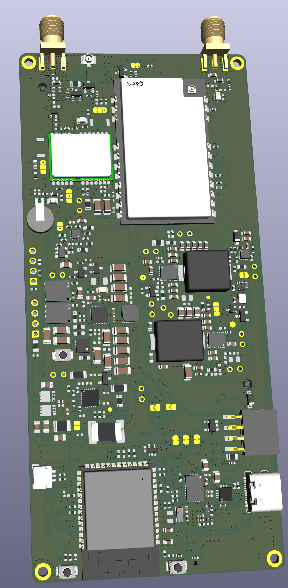

# parsnip-node
A battery-powered, portable Meshtastic/Meshcore node built around the ESP32-S3, an Ebyte E22P-915M30S LoRa front end, and a u-blox NEO-M9N GNSS receiver. Designed in KiCad, it targets 915 MHz operation in Canada under ISED RSS-247.

## Overview

The goal is a self-contained LoRa node that pairs one of the longest range, best value LoRa modules, with an accurate GNSS reciever, running off two 21700 cells in series, to connect to other people on the LoRa mesh network community.

### Schematic - v2

<table>
  <tr>
    <td align="center" width="33%">
      <a href="lib/img/schematic-gnss.png"></a>
      <br><sub><b>GNSS / active antenna</b></sub>
    </td>
    <td align="center" width="33%">
      <a href="lib/img/schematic-lora.png"></a>
      <br><sub><b>LoRa front end</b></sub>
    </td>
    <td align="center" width="33%">
      <a href="lib/img/schematic-rails.png"></a>
      <br><sub><b>Power rails</b></sub>
    </td>
  </tr>
  <tr>
    <td align="center" width="33%">
      <a href="lib/img/schematic-charger.png"></a>
      <br><sub><b>Charger / BMS</b></sub>
    </td>
    <td align="center" width="33%">
      <a href="lib/img/schematic-usb.png"></a>
      <br><sub><b>USB-C / PD</b></sub>
    </td>
    <td align="center" width="33%">
      <a href="lib/img/schematic-peripherals.png"></a>
      <br><sub><b>Peripherals</b></sub>
    </td>
  </tr>
</table>

### PCB - v2

<p align="center">
  
</p>

### 3D Render - v2

<p align="center">
  
</p>

### In the field - v1

<table>
  <tr>
    <td align="center" width="33%">
      
      <br><sub><b>Assembled board</b></sub>
    </td>
    <td align="center" width="33%">
      
      <br><sub><b>Outdoor testing</b></sub>
    </td>
    <td align="center" width="33%">
      
      <br><sub><b>Outdoor testing, back</b></sub>
    </td>
  </tr>
</table>

## Hardware
 
| Function | Part | Notes |
| --- | --- | --- |
| MCU / radio host | Seeed XIAO ESP32-C6 | Used as an SMD/castellated module for easy soldering|
| LoRa | Ebyte E22P-915M30S | SX1262 + external PA, up to 30 dBm |
| GNSS | u-blox NEO-M9N | GPS / GLONASS / Galileo / BeiDou |
| Boost | TI TPS61033 |  |
| Power mux | TI TPS2116 | USB / battery source selection |
| Battery protection | TI BQ29700 | Single-cell protection |
| Reverse polarity | AO3401A P-channel MOSFET | Input protection |
| Cell | 18650 3500mAh Li-ion | Single cell |
 
### Board
 
- 4-layer, 55 x 100 mm
- JLCPCB `JLC04161H-7628` stackup, 1 oz copper
- L1-L2 prepreg 0.2104 mm, Dk 4.4
- RF: 0.36mm trace width for ~50 Ω CPWG on this stackup, ground rails stitched with 0.3 mm / 0.6 mm vias at roughly 1.5 to 2 mm pitch
  
### SX1262 to ESP32-C6 pin map
 
| Signal | GPIO |
| --- | --- |
| NSS | 21 |
| SCK | 19 |
| MISO | 20 |
| MOSI | 18 |
| DIO1 | 1 |
| BUSY | 7 |
| NRST | 16 |
| EN | 17 |
 
The E22P `EN` (module pin 6) is held high for both RX and TX. The T/R switch (pin 7) is driven automatically from the SX1262 DIO2 line, so the firmware sets `setDio2AsRfSwitch(true)`.
 
## Firmware
 
Firmware is a Meshtastic fork tracked as the `firmware` submodule ([LimesKey/firmware](https://github.com/LimesKey/firmware)). Development uses VS Code with the pioarduino extension, which Meshtastic pins for ESP32-C6 / Arduino-ESP32 3.x support. A device variant declares the pin map above and the PA control lines so TX actually keys up. Unfortunately there are some extensive changes to the Meshtastic firmware in order to incorporate a SPI GNSS module, as this is not natively supported by Meshtastic.
 
```bash
git clone --recurse-submodules https://github.com/LimesKey/parsnip-node.git
```